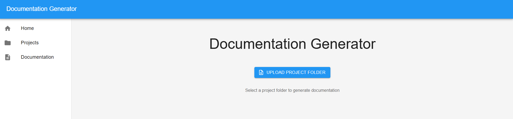
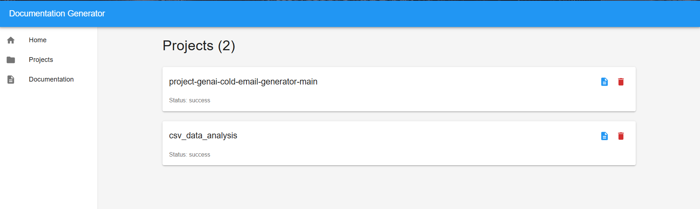
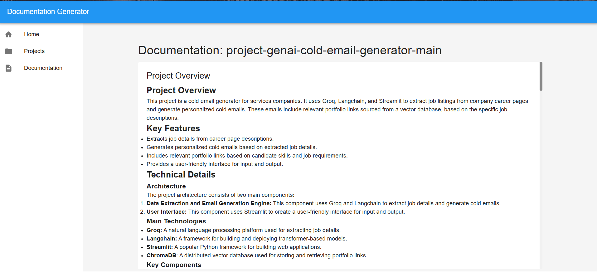
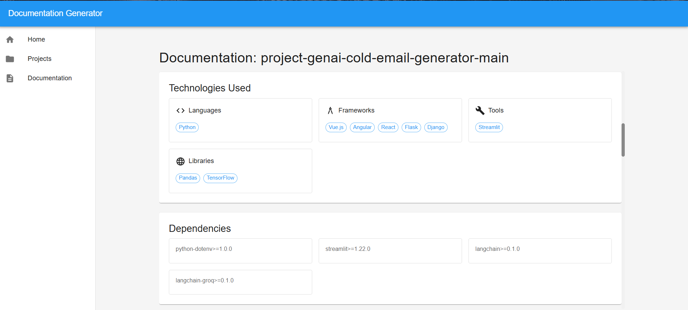

```markdown
# 📄 Documentation Generator  

## Overview  

The **Documentation Generator** is an AI-powered tool designed to automate the creation of comprehensive documentation for software projects. By analyzing the project's source code and structure, it generates detailed documentation, including project overviews, technology stacks, dependencies, and code component analysis.  

---

## 🛠️ Problem Definition  

### ⚡ The Challenge  

In software development, maintaining up-to-date and comprehensive documentation is often a challenging and time-consuming task. Developers frequently face the following issues:  

- **⏳ Time-Consuming**: Writing and updating documentation manually can be labor-intensive, especially for large projects.  
- **🎯 Inconsistency**: Documentation quality and structure can vary significantly across different projects and teams.  
- **🚀 Onboarding Delays**: New team members often struggle to understand the codebase without clear documentation, leading to longer onboarding times.  
- **🧠 Knowledge Gaps**: Lack of documentation can result in knowledge silos, where only a few team members understand certain parts of the codebase.  

### ✅ The Solution  

The **Documentation Generator** addresses these challenges by providing an automated solution that:  

- **⏱️ Saves Time**: Automatically generates documentation, freeing developers to focus on coding.  
- **📋 Ensures Consistency**: Produces structured and uniform documentation across projects.  
- **👩‍💻 Facilitates Onboarding**: Provides clear and comprehensive documentation, making it easier for new team members to understand the codebase.  
- **🌐 Bridges Knowledge Gaps**: Ensures that all parts of the codebase are documented, reducing reliance on individual team members.  

---

## ✨ Key Features  

- **📄 Automatic Documentation**: Upload a project folder or zip file, and the tool generates documentation instantly.  
- **🤖 AI-Powered Analysis**: Uses AI to understand project structure and generate meaningful descriptions.  
- **🌍 Multi-Language Support**: Supports projects in various programming languages, including Python, JavaScript, and Java.  
- **🧩 Comprehensive Coverage**: Includes project overviews, technology stacks, dependencies, and code component analysis.  

---

## 🚀 Tech Stack  

- **Frontend**:  
  - React  
  - Material UI  
  - TypeScript  

- **Backend**:  
  - Python  
  - FastAPI  
  - Google Gemini AI  
  - LangChain  

- **Others**:  
  - Git  
  - Node.js  
  - npm/yarn  

---

## 🏃‍♂️ How to Run  

### Prerequisites  

- Python 3.8+  
- Node.js 16+  
- npm/yarn  
- Google Cloud API Key  

### Clone the Repository  

```bash
git clone https://github.com/Vaibhavbasidoni/AI-Powered-Documentation-Generator.git
cd AI-Powered-Documentation-Generator
```

### Backend Setup  

1. Navigate to the backend directory  
   ```bash
   cd backend
   ```

2. Create and activate a virtual environment  

   ```bash
   python -m venv venv
   ```

   - On **Windows**:  
     ```bash
     venv\Scripts\activate
     ```

   - On **Mac/Linux**:  
     ```bash
     source venv/bin/activate
     ```

3. Install dependencies  

   ```bash
   pip install -r requirements.txt
   ```

4. Create `.env` file and add your Google Cloud API key  

   In `.env` file, add the following:  

   ```
   GOOGLE_API_KEY=your_api_key_here
   ```

5. Run the server  

   ```bash
   uvicorn app.main:app --reload
   ```

### Frontend Setup  

1. Navigate to the frontend directory  
   ```bash
   cd frontend
   ```

2. Install dependencies  

   ```bash
   npm install
   ```

3. Start the development server  

   ```bash
   npm run dev
   ```

The application will be available at:  
- **Frontend**: [http://localhost:5173](http://localhost:5173)  
- **Backend API**: [http://localhost:8000](http://localhost:8000)

---

## 🚀 Usage  

1. **📂 Upload Project**: Drag and drop your project folder or zip file into the application.  
2. **🔍 View Documentation**: Once the analysis is complete, view the generated documentation in a structured format.  
3. **📥 Download or Share**: Export the documentation for offline use or share it with your team.  

---

## 🖼️ Images and Previews  

1.   
   *This image shows the user interface of the Documentation Generator tool, where users can upload their project folders to generate comprehensive documentation.*  

2.   
   *This image showcases the "Projects" section of the Documentation Generator tool. It displays a list of uploaded projects, each with its name, status, and action buttons. The user can view or delete each project from this interface.*  

3.   
   *This image shows the generated documentation for the "project-genai-cold-email-generator-main" project. It provides a detailed overview of the project, including its key features, technical details, and main components.*  

4.   
   *This image displays the "Technologies Used" and "Dependencies" sections of the generated documentation for the "project-genai-cold-email-generator-main" project. It provides a detailed breakdown of the programming languages, frameworks, tools, libraries, and dependencies used in the project.*  

5.   
   *This image provides a detailed breakdown of the file's functions and classes, including their parameters and purposes. Additionally, it highlights the absence of documentation for some functions and classes, suggesting potential areas for improvement in the future.*  

6.   
   *This image provides a detailed breakdown of the code's metrics, including the number of lines of code, comments, and documentation coverage. Additionally, it offers recommendations for improvement, such as optimizing the code, increasing commenting, and creating documentation.*  

---

## Conclusion  

The **Documentation Generator** is an essential tool for any development team looking to streamline their documentation process, improve codebase understanding, and enhance team collaboration. By leveraging AI, it transforms the way documentation is created and maintained, making it an invaluable asset in the software development lifecycle.  

---
```

